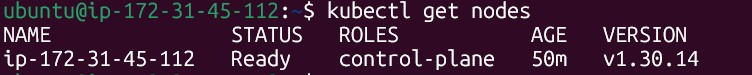
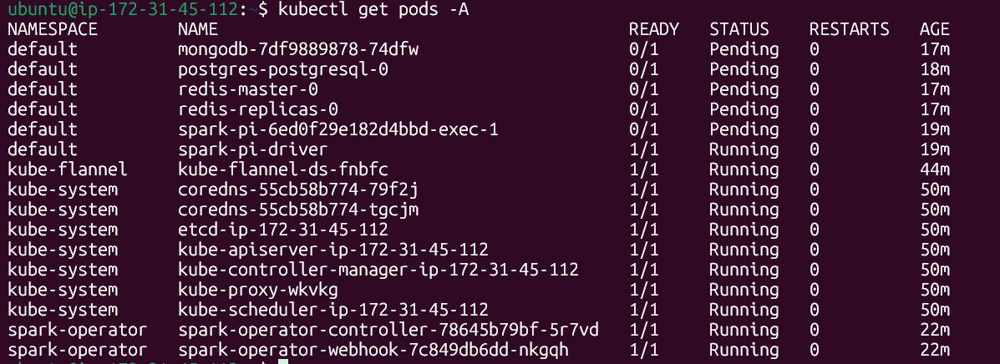
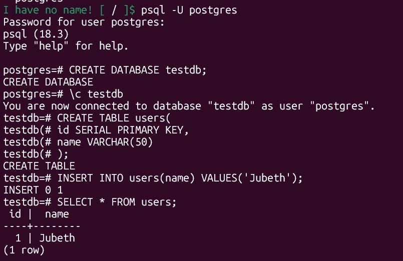
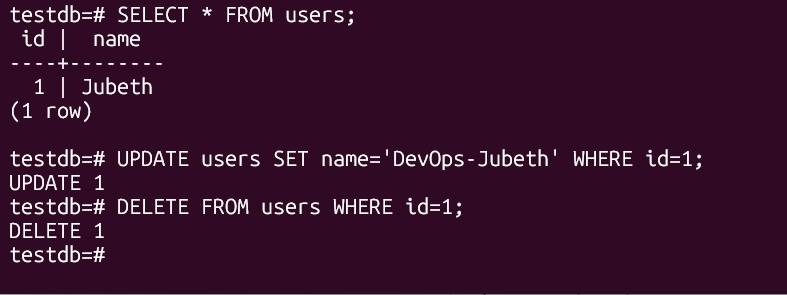
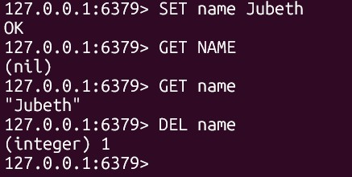

# Kubernetes DevOps Assignment

## Objective
Deploy a self-hosted Kubernetes cluster using kubeadm and deploy Spark, PostgreSQL, MongoDB, and Redis. Execute a sample Spark job and perform CRUD operations on databases.

---

## Environment
- AWS EC2 Ubuntu 22.04
- Kubernetes v1.30
- Helm
- containerd
- Flannel CNI

---

## Components
- Apache Spark
- PostgreSQL
- MongoDB
- Redis

---

## Tasks Completed
- Kubernetes cluster setup using kubeadm
- Flannel CNI setup
- Spark Operator deployment using Helm
- SparkPi sample job execution
- PostgreSQL CRUD operations
- Redis CRUD operations
- MongoDB deployment
- Local storage provisioner setup

---

## Verification Commands

### Kubernetes
```bash
kubectl get nodes
```

### Spark
```bash
kubectl logs spark-pi-driver
```

### PostgreSQL
CRUD operations completed using:
```sql
CREATE
SELECT
UPDATE
DELETE
```

### Redis
CRUD operations completed using:
```redis
SET
GET
DEL
```

---

## Project Structure

```text
k8s-devops-assignment/
├── README.md
├── commands/
│   └── setup-commands.txt
├── manifests/
│   └── spark-pi.yaml
├── screenshots/
│   ├── 01-kubernetes-node-ready.jpg
│   ├── 02-spark-operator-running.jpg
│   ├── 03-main-services-running.jpg
│   ├── 04-spark-pi-result.jpg
│   ├── 05-postgres-create-read.jpg
│   ├── 06-postgres-update-delete.jpg
│   └── 07-redis-crud.jpg
├── architecture/
└── notes/
```

---

## Screenshots

### 1. Kubernetes Node Ready


### 2. Spark Operator Running


### 3. Main Services Running


### 4. SparkPi Sample Job


### 5. PostgreSQL Create and Read


### 6. PostgreSQL Update and Delete


### 7. Redis CRUD Operations


---

## Summary
Successfully deployed a self-hosted Kubernetes cluster using kubeadm on AWS EC2, deployed Apache Spark using Helm, executed a SparkPi sample job, installed PostgreSQL, MongoDB, and Redis, and performed CRUD operations with proper documentation and screenshots.
